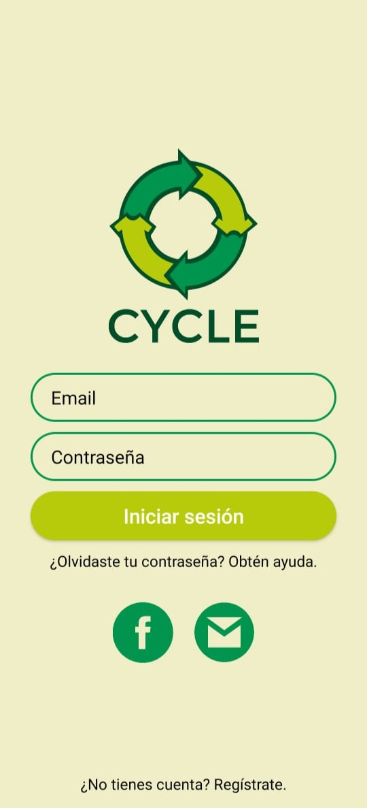
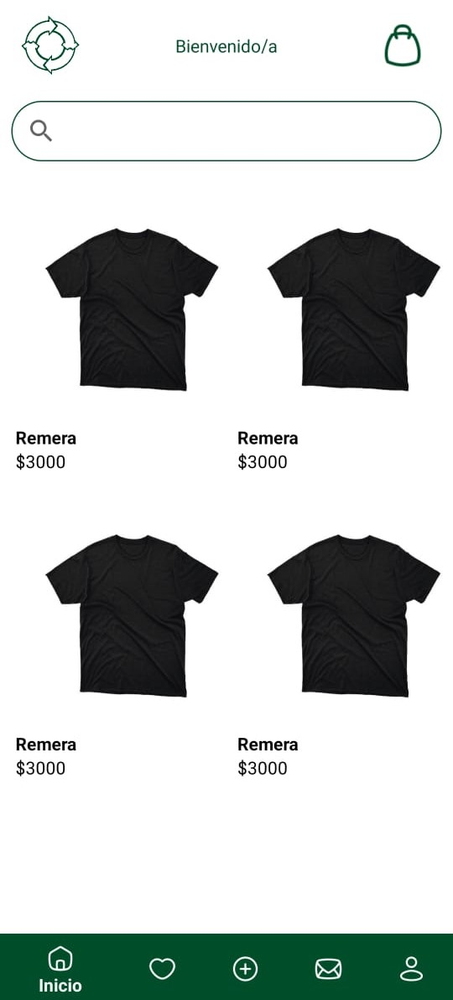
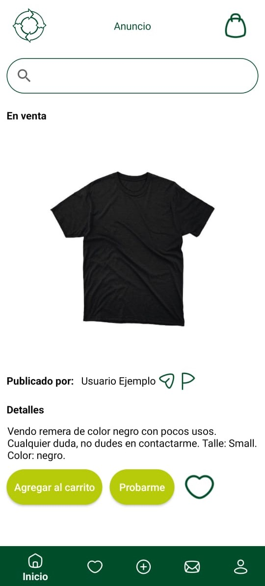

# Demo de Moda Circular con Realidad Aumentada (RA)

## Descripción

Este repositorio contiene una demo de una aplicación móvil de Moda Circular con Realidad Aumentada (RA). Esta aplicación es parte de mi tesis final de carrera. La aplicación permite a los usuarios iniciar sesión, registrarse, visualizar prendas de muestra y ver detalles de las mismas. Aunque algunas funciones aún están en desarrollo, los usuarios pueden tener una idea de cómo funcionará la aplicación final.

## Funciones

- Iniciar sesión y registrar usuario.
- Pantalla de inicio con cuatro prendas de muestra.
- Pantalla de publición del anuncio de la prenda con descripción, precio, talle y color de la prenda.
- Función de prueba de prenda con RA.

## Capturas de pantalla

A continuación, se muestran algunas capturas de pantalla de la aplicación:

   

## Demostración e Instalación

Podes ver un video de la aplicación en funcionamiento y descargar el archivo APK para probar la aplicación en tu celular desde este [enlace](https://drive.google.com/drive/folders/16wY_dsXtOT7Uyr-Qndx4P6CPZhX0WfC8?usp=sharing).

Para instalar el archivo APK en tu dispositivo Android, sigue estos pasos:

1. Descarga el archivo APK en tu celular desde el [enlace](https://drive.google.com/drive/folders/16wY_dsXtOT7Uyr-Qndx4P6CPZhX0WfC8?usp=sharing).
2. Ve a "Configuración" > "Seguridad" y habilita "Fuentes desconocidas".
3. Ve hasta la ubicación donde descargaste el archivo APK.
4. Toca el archivo APK para iniciar la instalación.
5. Sigue las instrucciones en pantalla para completar la instalación.

¡Muchas gracias por probar la demo de la aplicación de Moda Circular con RA!
